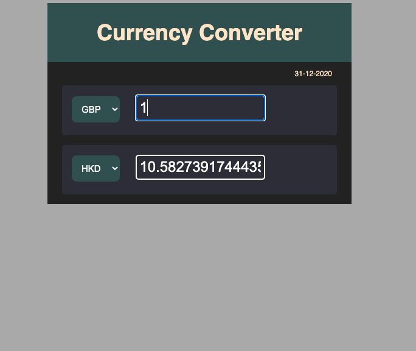

<h1 align="center">
  FX Currency Converter
</h1>

## Objective
Creating a foreign exchange currency converter that connects to an API

## Progress
 - Currency converter showing correct rates when input
 - Current date provided from API
 - Mock API saved to response
 - API mocked in test

## Improvements
 - Dropdown menu (select)

## Installation

1. `npm install`
2. To run `node app` in terminal
3. Navigate to localhost3000

## Screenshot

 
Currency conversion of GBP to HKD

## Tech Stack
HTML, CSS, Javascript, Node

## Testing (Mocha/Chai/Nock) 
3 pass

## Collaborators
mattybwoy

